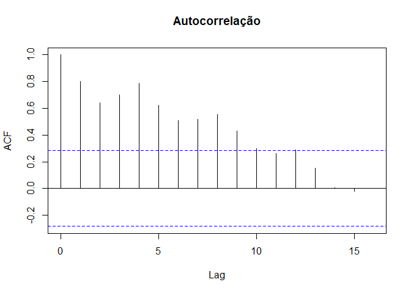
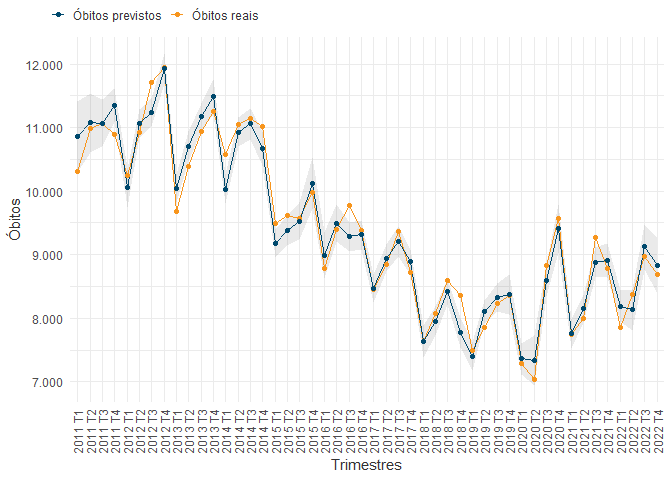
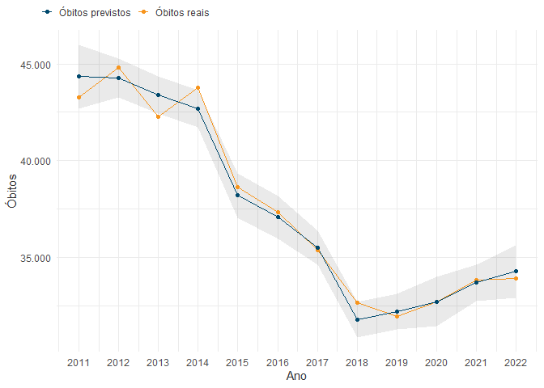
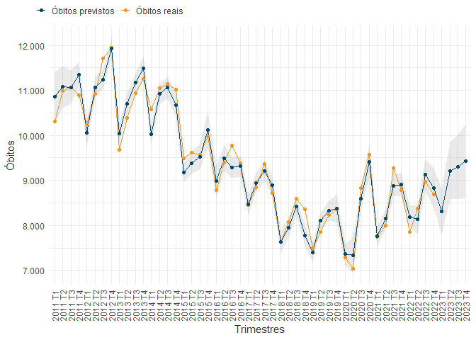
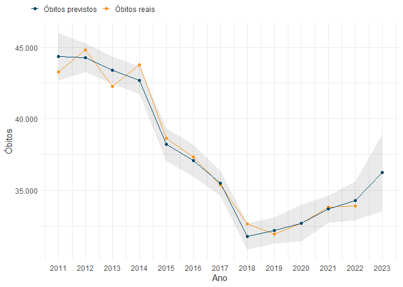
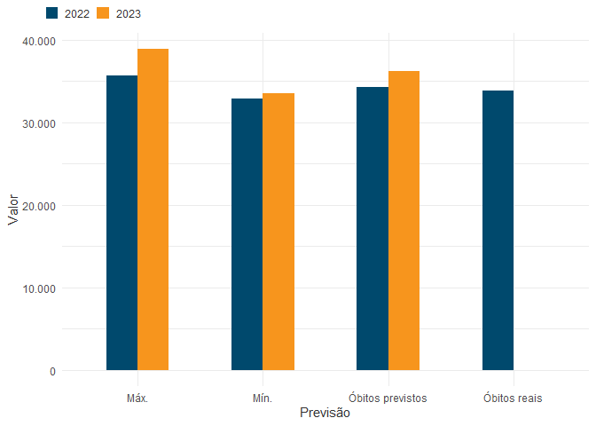

# Modelo Preditivo Trimestral de Mortes no Trânsito


- [Descrição](#descrição)
- [Dados](#dados)
- [Modelagem](#modelagem)
- [Previsões](#previsões)
  - [Previsão de 2022](#previsão-de-2022)
  - [Previsão de 2023](#previsão-de-2023)
  - [Tabela de previsões](#tabela-de-previsões)

## Descrição

Modelo de âmbito nacional para a previsão de número de mortos em
trânsito em resolução temporal trimestral. Este modelo é criado a partir
de uma regressão linear multivariada com as variáveis:

- Frota (veículos totais, motocicletas e automóveis - RENAVAM);
- PIB (em dólar - Bacen);
- Acidentes totais, acidentes fatais e feridos em rodovias federais
  (PRF);
- Óbitos em trânsito (variável dependente - DataSUS).

Pacotes utilizados:

``` r
library(tidyverse)
library(tidymodels)
library(here)
library(fleetbr)
library(arrow)
library(roadtrafficdeaths)
library(onsvplot)
library(knitr)
```

## Dados

Os dados foram pré-processados e agrupados em trimestres utilizando a
função `lubridate::quarter()` para a criação do *dataset* do modelo,
como indica a tabela:

| data    | trimestre | veiculos | automovel | motocicleta | mortes |    pib | acidentes | acidentes_fatais | feridos | mortes_prf |
|:--------|----------:|---------:|----------:|------------:|-------:|-------:|----------:|-----------------:|--------:|-----------:|
| 2011 T1 |         1 | 66116077 |  44373472 |    16928127 |  10306 | 609903 |     47622 |             1747 |   26960 |       2126 |
| 2011 T2 |         2 | 67545237 |  45227949 |    17406932 |  10990 | 680395 |     48077 |             1802 |   26386 |       2120 |
| 2011 T3 |         3 | 69047967 |  46110917 |    17922122 |  11064 | 680126 |     47684 |             1789 |   26164 |       2156 |
| 2011 T4 |         4 | 70543535 |  47002992 |    18427421 |  10896 | 644058 |     48943 |             1820 |   27317 |       2273 |
| 2012 T1 |         1 | 71840783 |  47768900 |    18869205 |  10251 | 638271 |     45616 |             1578 |   25801 |       1994 |
| 2012 T2 |         2 | 73183019 |  48624245 |    19274618 |  10916 | 602799 |     46001 |             1740 |   25669 |       2115 |
| 2012 T3 |         3 | 74689706 |  49653810 |    19667976 |  11705 | 605760 |     44148 |             1775 |   25484 |       2160 |
| 2012 T4 |         4 | 76137191 |  50616879 |    20061656 |  11940 | 616720 |     48803 |             1910 |   27514 |       2394 |

Como demonstram os gráficos de série temporal e autocorrelação, óbitos
em trânsito possuem uma sazonalidade trimestral:




## Modelagem

O modelo foi treinado com 75% dos dados, tendo seu desempenho avaliado
com as funções de métricas `rmse()`, `mae()` e `rsq()`:

| Métrica |  Valor |
|:--------|-------:|
| RMSE    | 306.28 |
| MAE     | 244.44 |
| RSQ     |   0.91 |

## Previsões

### Previsão de 2022





### Previsão de 2023





### Tabela de previsões

| Previsão         | Valor            |  Ano |
|:-----------------|:-----------------|-----:|
| Óbitos reais     | 33894            | 2022 |
| Óbitos previstos | 34277.8790955293 | 2022 |
| Mín.             | 32916.4107831219 | 2022 |
| Máx.             | 35639.3474079368 | 2022 |
| Óbitos reais     | \-               | 2023 |
| Óbitos previstos | 36241.2403957546 | 2023 |
| Mín.             | 33550.8644473077 | 2023 |
| Máx.             | 38931.6163442015 | 2023 |


